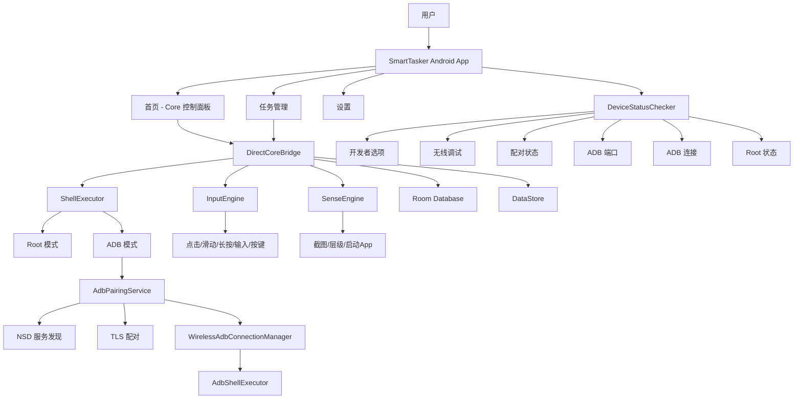

# 00. Agent 总览与读取指南

> 项目：SmartTasker / AI 安卓自动化任务产品  
> 版本：v1.0.0  
> 日期：2026-05-24  
> 底层参考：AutoLXB 二次开发 → 独立 DirectCoreBridge

> ⚠️ **第一原则（2026-06-12 确立）**：本项目以 GitHub `SmallvL/SmartTasker` 仓库为唯一权威上游。
> 本地旧项目 `D:\1_AIagnet\SMARTTASK\android\` 已 DEPRECATED，不再维护。
> 详见项目根目录 [PRODUCT_DIRECTION.md](../PRODUCT_DIRECTION.md)。

## 1. 文档包目标

本文件是给产品、开发、设计、测试与 AI coding agent 使用的入口文档。它将原来的单一 PRD 拆分为多个可独立读取、可引用、可执行的 Markdown 文档，方便后续开发与进度管理。

本产品定位：

> **Tasker 的 AI 增强智能版：用户用一句话创建安卓自动化任务，AI 首次学习流程，后续沉淀为可编辑、可复用、可修复、可回滚的自动化路线。**

核心闭环：

```text
自然语言创建任务
 -> AI 首次试跑
 -> 生成路线
 -> Route Studio 人工编辑
 -> 保存路线版本
 -> 后续优先路线回放
 -> 失败后 Trace 诊断和 AI 修复建议
```

---

## 2. 当前项目状态 (v1.0.0)

### 已完成

| 模块 | 状态 | 说明 |
|---|---|---|
| DirectCoreBridge 引擎 | ✅ 完成 | 独立自动化引擎，无需外部进程 |
| ShellExecutor | ✅ 完成 | Root 模式 + ADB 模式双支持 |
| InputEngine | ✅ 完成 | tap / swipe / longPress / inputText / pressKey |
| SenseEngine | ✅ 完成 | screenshot / dumpHierarchy / launchApp |
| ADB 无线配对 | ✅ 完成 | TLS 配对 (libadb-android)，NSD 发现 |
| 设备状态诊断 | ✅ 完成 | 6 项检查 + 实时仪表盘 |
| 自动重连 | ✅ 完成 | 启动时从已保存端点重连 |
| UI 框架 | ✅ 完成 | Compose + Material3 暗色主题 |
| 设置页面 | ✅ 完成 | 8+ 子页面 |
| 数据层 | ✅ 完成 | Room + DataStore + Repository |
| 后台服务 | ✅ 完成 | TaskExecutionService + 定时触发 |

### 进行中 / 骨架

| 模块 | 状态 | 说明 |
|---|---|---|
| AI 任务创建闭环 | 🔶 部分完成 | TaskSpec parser 存在，LLM 未接线 |
| 路线学习与展示 | 🔶 骨架 | RouteAdapter 存在，UI 骨架 |
| Route Studio | 🔶 骨架 | 页面框架已搭建 |
| Safety Guard | 🔶 基础 | 基础风控策略 |
| Trace Explainer | 🔶 骨架 | 页面框架 |
| Permission Doctor | 🔶 基础 | 基础检查项 |

### 未开始

| 模块 | 说明 |
|---|---|
| 路线版本管理 | 多版本保存与切换 |
| 路线回放执行 | 基于已保存路线的自动回放 |
| LLM 集成 | 真实 LLM 调用任务解析 |
| 端到端测试 | 真实任务全流程验证 |

---

## 3. 文档拆分结构

| 文件 | 用途 | 推荐读者 / Agent |
|---|---|---|
| `00_AGENT_README_总览.md` | 文档导航、开发可行性评估、Agent 读取顺序 | 全部 |
| `01_PRODUCT_MVP_PRD.md` | 产品定位、MVP 范围、用户流程、功能清单 | 产品、全栈 Agent |
| `02_UI_UX_OPENAI_STYLE_GUIDE.md` | 现代简约 UI 风格、页面设计、交互逻辑 | UI/UX、Android Agent |
| `03_TECH_ARCH_AUTOLXB_INTEGRATION.md` | 技术架构、AutoLXB 复用边界、集成方案 | Android、后端、架构 Agent |
| `04_ROUTE_STUDIO_SPEC.md` | 路线编辑器、人工编辑、版本、单步测试 | Android、产品、测试 Agent |
| `05_AI_TASK_WIZARD_AND_PROMPTS.md` | AI 任务创建、Prompt、Schema、模型调用边界 | AI Agent、后端 Agent |
| `06_DATA_SCHEMA_AND_API_CONTRACTS.md` | 数据结构、接口契约、本地表设计、Core Bridge | Android、后端 Agent |
| `07_SECURITY_PERMISSION_COST.md` | 安全风控、权限体检、成本控制 | 安全、Android、产品 Agent |
| `08_DEV_PLAN_PROGRESS_MANAGEMENT.md` | 6 周排期、进度管理、里程碑、DoD | PM、Tech Lead、Agent |
| `09_TEST_ACCEPTANCE_RISK.md` | 验收标准、测试用例、风险与应对 | QA、开发 Agent |
| `10_BACKLOG_ISSUES.md` | 可直接拆成 Issue 的开发任务列表 | PM、开发 Agent |

---

## 4. Agent 推荐读取顺序

### 4.1 做产品设计时

```text
00 -> 01 -> 02 -> 04 -> 07 -> 09
```

### 4.2 做 Android 开发时

```text
00 -> 01 -> 02 -> 03 -> 04 -> 06 -> 08 -> 10
```

### 4.3 做 AutoLXB 集成时

```text
00 -> 03 -> 06 -> 09 -> 10
```

### 4.4 做 AI Prompt / Agent 逻辑时

```text
00 -> 05 -> 06 -> 07 -> 09
```

### 4.5 做测试验收时

```text
00 -> 01 -> 04 -> 07 -> 08 -> 09 -> 10
```

---

## 5. 反推评估：文档是否足以完成开发？

结论：

> **文档包已支撑 M0-M1 里程碑的完整开发。当前 v1.0.0 已实现核心引擎、ADB 通信、设备诊断、UI 框架，文档体系验证通过。**

### 5.1 已验证支撑的部分

| 能力 | 是否验证 | 说明 |
|---|---|---|
| 产品定位 | ✅ | "AI 首次学习 + 路线沉淀 + 后续复用" 方向正确 |
| MVP 核心闭环 | ✅ | 核心引擎独立可用，双模式通信验证通过 |
| AutoLXB 复用方向 | ✅ | 确认独立实现 DirectCoreBridge，不再依赖外部 lxb-core 进程 |
| Core Bridge 接口 | ✅ | ShellExecutor / InputEngine / SenseEngine 接口已落地 |
| 安全风险意识 | 🔶 基础 | 已定义框架，策略细化待 M5 |

### 5.2 待后续验证的部分

| 缺口 | 影响 | 目标里程碑 |
|---|---|---|
| LLM 任务解析集成 | AI 创建任务无法端到端 | M2 |
| 路线存储与回放 | 核心产品价值未闭环 | M3 |
| Route Studio 编辑 | 人工可控性未实现 | M4 |
| Safety Guard 策略 | 安全风控粒度不够 | M5 |

---

## 6. 总体架构图



---

## 7. 当前交付物

### 已交付
- SmartTasker v1.0.0 APK（可编译运行）
- 完整文档包（11 份 Markdown）
- 核心引擎 DirectCoreBridge
- ADB TLS 无线配对完整实现
- 设备状态诊断仪表盘

### 推荐下一步

1. **M2**：接入 LLM，完成 AI 任务创建闭环
2. **M3**：实现路线学习、保存与回放
3. **M4**：完善 Route Studio 编辑功能
4. **M5**：完善安全策略、Trace 解释、权限体检
5. 端到端测试验证
