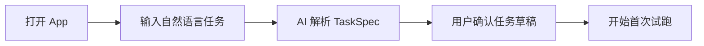
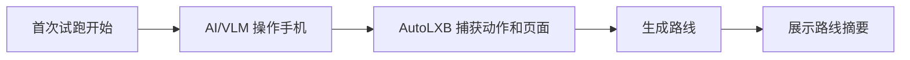
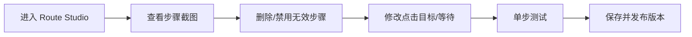
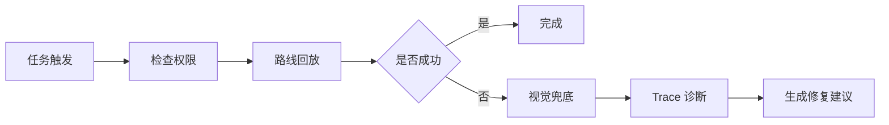

# 01. 产品 MVP PRD

> 项目：SmartTask AI / AI 安卓自动化任务产品  
> 版本：v0.2  
> 日期：2026-05-23  
> 底层参考：AutoLXB 二次开发

## 1. 产品定位

产品定位：

> **AI 辅助的安卓自动化任务创建与路线编辑工具。**

一句话卖点：

> **一句话创建手机自动化任务，AI 先学一次，以后自动执行。**

核心不是“每次都让 AI 操作手机”，而是让 AI 把一次成功流程沉淀成可复用路线。

---

## 2. 目标用户

| 用户 | 需求 | MVP 支持方式 |
|---|---|---|
| 普通用户 | 不懂自动化，但想减少重复手机操作 | 一句话创建 + AI 首次试跑 |
| 进阶用户 | 希望能手动修路线，提高稳定性 | Route Studio 简版 |
| 极客用户 | 想复用 AutoLXB 能力，导入导出任务 | 本地数据结构和后续模板能力预留 |

---

## 3. 核心问题

传统 Tasker 类工具的问题：

- 概念门槛高。
- 任务配置复杂。
- UI 自动化脚本难写。
- App 页面变化后维护成本高。

纯 LLM/VLM 自动控制的问题：

- 每次调用成本高。
- 速度慢。
- 输出随机。
- 安全不可控。

本产品的解法：

```text
首次 AI 学习
 -> 路线沉淀
 -> 人工可视化编辑
 -> 后续路线优先执行
 -> 失败时视觉兜底与修复建议
```

---

## 4. MVP 成功标准

MVP 验证一句话：

> 用户是否能用自然语言创建一个可重复执行的安卓自动化任务，并能在路线出错时通过可视化编辑修复。

### 必须达成

| 指标 | 目标 |
|---|---:|
| 用户一句话创建任务 | 支持 |
| 生成 TaskSpec 草稿 | 支持 |
| 首次试跑 | 支持 |
| 成功后路线保存 | 支持 |
| Route Studio 查看路线 | 支持 |
| 人工删除/禁用/修改关键步骤 | 支持 |
| 后续路线复用 | 支持 |
| 高风险动作确认 | 支持 |
| 失败 Trace 解释 | 支持 |

---

## 5. MVP 功能范围

### P0 功能

| 模块 | 功能 |
|---|---|
| 首页 | Core 状态、任务入口、最近运行概览 |
| AI 任务创建 | 自然语言输入、TaskSpec 生成、任务确认 |
| 首次试跑 | 调用 AutoLXB 执行一次任务 |
| 路线学习结果 | 展示 AI 学到的步骤和建议 |
| Route Studio 简版 | 查看步骤、截图、删除、禁用、修改点击目标、修改等待时间 |
| 路线版本 | 保存草稿、发布版本、回滚 |
| 执行记录 | 查看成功/失败记录 |
| Trace 解释 | 把失败日志解释成人话 |
| 权限体检 | 检查 Core、ADB、无障碍、通知、电池、模型 |
| 安全确认 | 发送、删除、提交等高风险动作前暂停 |

### P1 功能

| 模块 | 功能 |
|---|---|
| AI 路线摘要 | 对路线生成人话解释 |
| AI 修复建议 | 对失败步骤给出修复方案 |
| 成本统计 | 每个任务展示模型调用次数 |
| 单步测试增强 | 从某步开始运行 |
| 用户锁定步骤 | AI 不得覆盖人工锁定步骤 |

### MVP 不做

| 不做 | 原因 |
|---|---|
| 社区模板市场 | 需要安全审核和生态机制 |
| 多设备同步 | 非核心闭环 |
| 插件系统 | 开发成本高 |
| 复杂分支循环 | 先验证路线型任务 |
| 自动支付/转账 | 安全风险过高 |

---

## 6. 用户主流程

### 6.1 新建任务



### 6.2 首次学习路线



### 6.3 编辑并发布路线



### 6.4 后续执行



---

## 7. 页面清单

| 页面 | 优先级 | 说明 |
|---|---|---|
| 首页 | P0 | 一句话入口 + Core 状态 |
| 任务创建页 | P0 | 输入自然语言 |
| 任务草稿确认页 | P0 | 确认任务结构 |
| 首次试跑页 | P0 | 展示试跑状态 |
| 路线学习结果页 | P0 | 展示学到的步骤 |
| Route Studio | P0 | 路线编辑器 |
| 任务列表 | P0 | 管理所有任务 |
| 任务详情 | P0 | 启用、禁用、查看版本 |
| 执行记录 | P0 | 成功/失败历史 |
| Trace 解释页 | P0 | 失败诊断 |
| 权限体检页 | P0 | 环境检查 |
| 模型配置页 | P0 | API endpoint / key / model |
| 安全确认弹窗 | P0 | 高风险动作确认 |
| 路线版本历史 | P1 | 版本对比和回滚 |

---

## 8. 任务类型

### 8.1 快速任务

立即执行一次，适合用户验证任务目标和模型能力。

### 8.2 定时任务

固定时间重复执行，如每日签到。

### 8.3 通知触发任务

收到指定 App 通知后触发，如收到快递通知后打开详情页。

MVP 的优先顺序：

```text
快速任务 -> 定时任务 -> 通知触发任务
```

---

## 9. 核心体验原则

1. 用户不需要先理解自动化概念。
2. AI 输出必须可解释、可修改。
3. 路线编辑必须人工可控。
4. 高风险动作必须可见、可确认、可取消。
5. 失败原因必须尽量翻译成人话。
6. 后续执行优先使用路线，减少模型调用。

---

## 10. PRD 验收

本 PRD 可用于：

- 创建 MVP 项目计划。
- 拆分 Android / AI / Core Bridge / QA 任务。
- 指导页面原型设计。
- 指导 agent 读取功能边界。

详细排期见：`08_DEV_PLAN_PROGRESS_MANAGEMENT.md`。  
详细 Issue 见：`10_BACKLOG_ISSUES.md`。
