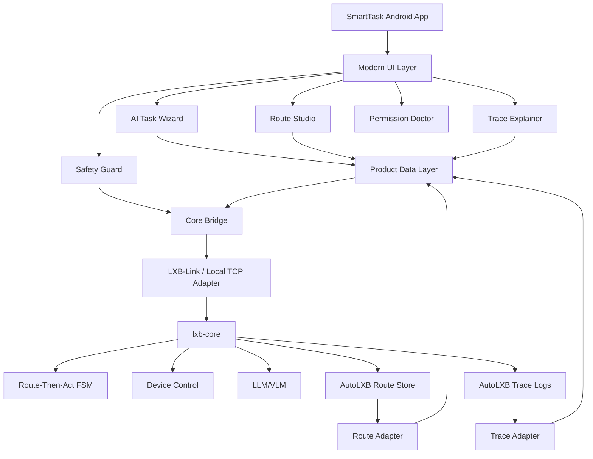
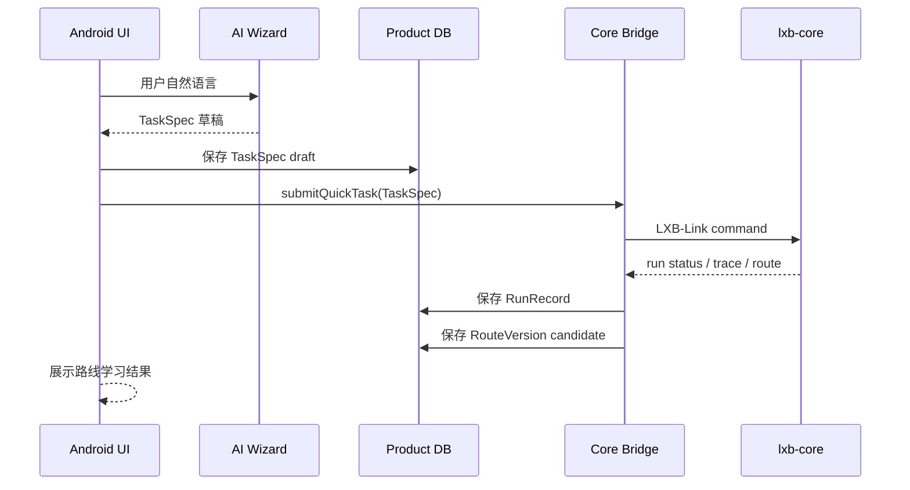
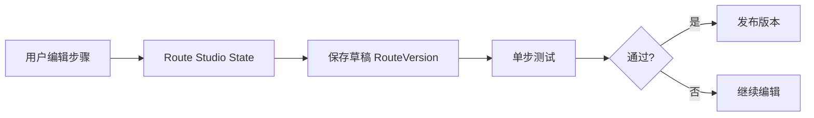
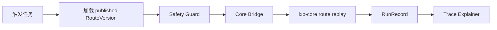

# 03. 技术架构与 AutoLXB 集成方案

> 项目：SmartTask AI / AI 安卓自动化任务产品  
> 版本：v0.2  
> 日期：2026-05-23  
> 底层参考：AutoLXB 二次开发

## 1. 技术目标

MVP 技术目标：

> 在尽量不破坏 AutoLXB 核心执行逻辑的前提下，构建一个新的产品增强层，实现自然语言创建、路线编辑、版本管理、Trace 解释、安全确认和权限体检。

原则：

```text
复用执行内核
封装通信边界
扩展产品数据层
避免直接侵入 FSM 核心
```

---

## 2. 总体架构



---

## 3. 分层职责

### 3.1 UI Layer

负责：

- 首页。
- 任务创建。
- Route Studio。
- 运行记录。
- Trace 解释。
- 权限体检。
- 模型配置。

### 3.2 Product Logic Layer

负责：

- TaskSpec 管理。
- RouteVersion 管理。
- RouteStep 编辑。
- SafetyDecision。
- ModelUsage。
- RunRecord。

### 3.3 Core Bridge

负责与 AutoLXB 通信，避免产品层直接依赖底层实现。

核心能力：

```text
startCore()
getCoreStatus()
submitQuickTask(taskSpec)
submitScheduledTask(taskSpec)
submitNotificationTask(taskSpec)
getLatestRoute(taskId)
getLatestTrace(runId)
saveRoute(routeVersion)
runRoute(taskId, routeVersion)
runSingleStep(stepId)
stopCurrentRun()
```

### 3.4 Adapter Layer

负责格式转换：

| Adapter | 作用 |
|---|---|
| Route Adapter | AutoLXB route <-> Product RouteVersion |
| Trace Adapter | AutoLXB JSONL trace <-> RunRecord / Diagnosis |
| Task Adapter | TaskSpec <-> AutoLXB task config |
| Model Adapter | OpenAI-compatible endpoint config |

### 3.5 AutoLXB Core

优先复用：

- `lxb-core`。
- Route-Then-Act FSM。
- Device Control。
- Task Route。
- Trace。
- Scheduler。
- Notification Trigger。

---

## 4. AutoLXB 复用边界

### 4.1 直接复用

| 能力 | 说明 |
|---|---|
| 点击/输入/滑动/返回 | 不重写底层动作 |
| 截图和 XML | 复用页面观测能力 |
| Route-Then-Act | 保持核心执行模式 |
| 快速任务 | 用于首次试跑 |
| 定时任务 | 用于 MVP 定时自动化 |
| 通知触发 | 用于通知类场景 |
| Trace JSONL | 用于诊断和解释 |

### 4.2 封装增强

| 能力 | 增强方式 |
|---|---|
| Route | 增加产品层 version、summary、edit_meta |
| Trace | 增加失败分类和人话解释 |
| Task Config | 增加自然语言解析和确认页 |
| Safety | 执行前增加策略判断和确认 |
| UI | 使用现代简约产品层重做体验 |

### 4.3 暂不建议改动

| 模块 | 原因 |
|---|---|
| FSM 核心状态流 | MVP 阶段避免执行不稳定 |
| ADB/Root 设备控制底层 | 非差异化重点 |
| 模型底层调用协议 | 先使用 OpenAI-compatible |
| Trace 原始写入逻辑 | 先读取和解释，不改写 |

---

## 5. Core Bridge 设计

### 5.1 接口形态

Android 内部建议定义 Repository / Service：

```kotlin
interface CoreBridge {
    suspend fun getCoreStatus(): CoreStatus
    suspend fun startCore(mode: CoreStartMode): CoreStartResult
    suspend fun submitQuickTask(task: TaskSpec): RunHandle
    suspend fun submitScheduleTask(task: TaskSpec): TaskId
    suspend fun submitNotificationTask(task: TaskSpec): TaskId
    suspend fun getRunStatus(runId: String): RunStatus
    suspend fun getLatestTrace(runId: String): TraceBundle
    suspend fun getLatestRoute(taskId: String): RawRouteBundle?
    suspend fun saveRoute(taskId: String, route: RouteVersion): SaveResult
    suspend fun runSingleStep(taskId: String, step: RouteStep): StepRunResult
    suspend fun stopRun(runId: String): StopResult
}
```

### 5.2 错误类型

```kotlin
sealed class CoreError {
    object CoreNotRunning
    object PermissionDenied
    object ModelUnavailable
    object DeviceDisconnected
    object RouteNotFound
    object TraceNotFound
    data class ProtocolError(val message: String)
    data class Unknown(val message: String)
}
```

---

## 6. 数据流

### 6.1 首次试跑数据流



### 6.2 路线编辑数据流



### 6.3 后续执行数据流



---

## 7. 第 1 周源码验证清单

必须验证：

| 编号 | 验证项 | 输出 |
|---|---|---|
| V01 | AutoLXB 是否能在目标设备编译运行 | 编译记录 |
| V02 | `lxb-core` 启动方式 | 启动命令/状态接口 |
| V03 | App 与 Core 通信协议 | LXB-Link 请求/响应样例 |
| V04 | Quick Task 提交格式 | raw config 样例 |
| V05 | Route 存储位置和结构 | route JSON 样例 |
| V06 | Trace 存储位置和结构 | trace JSONL 样例 |
| V07 | 单步执行是否已有接口 | 可行性结论 |
| V08 | Route 修改后是否可回放 | demo 记录 |
| V09 | 通知触发配置格式 | raw config 样例 |
| V10 | 模型配置格式 | endpoint / model 配置样例 |

验证后需要更新：

- `06_DATA_SCHEMA_AND_API_CONTRACTS.md`
- `10_BACKLOG_ISSUES.md`
- Core Bridge 真实接口。

---

## 8. 技术风险

| 风险 | 应对 |
|---|---|
| AutoLXB route 格式与预期不同 | 使用 Adapter，产品层不直接绑定 raw route |
| 单步测试底层不支持 | MVP 可通过“从该步骤构造临时路线”实现 |
| Trace 缺少截图引用 | 产品层执行时补充保存截图索引 |
| Core 通信协议复杂 | 第 1 周优先封装最小命令集 |
| Android 后台保活不稳定 | 权限体检 + 前台服务提示 |

---

## 9. MVP 技术交付判断

如果第 1 周完成 V01-V06，MVP 可以继续推进。

如果 V07 单步测试不可直接实现，不阻塞 MVP，可用临时路线方式替代。

如果 V05 route 无法稳定读取，MVP 需要降级为“Trace 步骤回放展示 + 手动保存任务配置”，但产品壁垒会显著下降，需优先解决。
