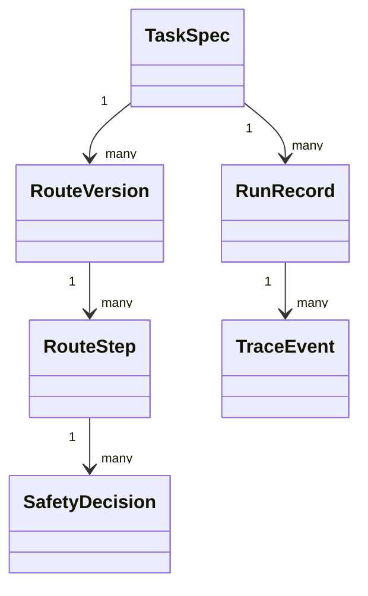

# 06. 数据结构与 API 契约

> 项目：SmartTask AI / AI 安卓自动化任务产品  
> 版本：v0.2  
> 日期：2026-05-23  
> 底层参考：AutoLXB 二次开发

## 1. 设计目标

本文件定义产品层数据结构和 Core Bridge 接口契约，方便 Android、AI、AutoLXB 适配和测试协同开发。

原则：

```text
产品层 schema 稳定
底层 AutoLXB raw 数据通过 Adapter 转换
所有 AI 输出必须 schema validation
所有运行结果必须记录 RunRecord
```

---

## 2. 核心实体



---

## 3. TaskSpec

```json
{
  "task_id": "task_001",
  "name": "淘宝芭芭农场收金币",
  "description": "每天早上打开淘宝芭芭农场并收取金币",
  "target_app": {
    "name": "淘宝",
    "package": "com.taobao.taobao",
    "confidence": 0.94
  },
  "trigger": {
    "type": "schedule",
    "time": "09:00",
    "repeat": "daily",
    "timezone": "Asia/Shanghai"
  },
  "execution": {
    "mode": "learn_first_then_replay",
    "route_enabled": true,
    "fallback_to_vision": true,
    "finish_after_route_replay": true
  },
  "risk": {
    "level": "low",
    "requires_confirmation": false
  },
  "status": "draft",
  "created_at": "2026-05-23T10:00:00-04:00",
  "updated_at": "2026-05-23T10:00:00-04:00"
}
```

### 字段说明

| 字段 | 说明 |
|---|---|
| task_id | 产品层任务 ID |
| target_app.package | Android 包名 |
| trigger.type | manual / schedule / notification |
| execution.mode | learn_first_then_replay 等 |
| status | draft / active / paused / archived |

---

## 4. RouteVersion

```json
{
  "route_id": "route_001",
  "task_id": "task_001",
  "version": "1.2.0",
  "status": "published",
  "source": "user_edit",
  "change_summary": "将第4步从坐标点击改为文本定位",
  "created_at": "2026-05-23T10:15:00-04:00",
  "published_at": "2026-05-23T10:20:00-04:00",
  "metrics": {
    "recent_success_rate": 0.92,
    "avg_duration_ms": 12000,
    "avg_model_calls": 0.1
  },
  "steps": []
}
```

状态：

```text
draft / published / archived / candidate
```

来源：

```text
ai_learned / user_edit / ai_suggestion_applied / fallback_repair_candidate
```

---

## 5. RouteStep

```json
{
  "step_id": "step_004",
  "index": 4,
  "enabled": true,
  "type": "tap",
  "summary": "点击芭芭农场入口",
  "screenshot_ref": "screenshots/step_004.png",
  "locator": {
    "primary": {
      "strategy": "text",
      "value": "芭芭农场",
      "confidence": 0.88
    },
    "fallbacks": [
      {
        "strategy": "content_desc",
        "value": "芭芭农场"
      },
      {
        "strategy": "coordinate",
        "x": 420,
        "y": 810
      }
    ]
  },
  "retry": {
    "max_attempts": 2,
    "interval_ms": 1000
  },
  "on_fail": {
    "action": "fallback_to_vision"
  },
  "risk": {
    "level": "low",
    "requires_confirmation": false
  },
  "edit_meta": {
    "source": "ai_learned",
    "user_modified": false,
    "locked_by_user": false
  }
}
```

### Step 类型

```text
open_app / tap / input / swipe / back / wait / assert / confirm / finish
```

### Locator 策略

```text
text / content_desc / resource_id / class_name / coordinate / visual_description / ocr_text
```

---

## 6. RunRecord

```json
{
  "run_id": "run_001",
  "task_id": "task_001",
  "route_version": "1.2.0",
  "trigger_type": "schedule",
  "started_at": "2026-05-23T09:00:00+08:00",
  "ended_at": "2026-05-23T09:00:14+08:00",
  "status": "failed",
  "duration_ms": 14000,
  "model_calls": 1,
  "failed_step_id": "step_004",
  "failure_type": "locator_not_found",
  "trace_ref": "traces/run_001.jsonl",
  "diagnosis": {
    "summary": "第4步未找到芭芭农场入口",
    "suggestion": "建议改用文本定位或视觉定位"
  }
}
```

状态：

```text
running / success / failed / cancelled / blocked_by_safety
```

Failure Type：

```text
app_not_started
permission_error
locator_not_found
click_failed
input_failed
timeout
model_error
safety_blocked
user_cancelled
unknown
```

---

## 7. SafetyDecision

```json
{
  "decision_id": "safe_001",
  "task_id": "task_001",
  "step_id": "step_006",
  "risk_level": "high",
  "risk_reason": "即将发送消息",
  "policy": "require_user_confirmation",
  "user_action": "allow_once",
  "created_at": "2026-05-23T10:30:00-04:00"
}
```

---

## 8. Core Bridge API

### 8.1 Core 状态

```kotlin
suspend fun getCoreStatus(): CoreStatus
```

返回：

```json
{
  "running": true,
  "mode": "wireless_adb",
  "version": "string",
  "port": 17999,
  "last_heartbeat_at": "2026-05-23T10:00:00-04:00"
}
```

### 8.2 提交快速任务

```kotlin
suspend fun submitQuickTask(task: TaskSpec): RunHandle
```

返回：

```json
{
  "run_id": "run_001",
  "task_id": "task_001",
  "status": "running"
}
```

### 8.3 获取运行状态

```kotlin
suspend fun getRunStatus(runId: String): RunStatus
```

返回：

```json
{
  "run_id": "run_001",
  "status": "running",
  "current_state": "VISION_ACT",
  "current_step_summary": "正在查找芭芭农场入口"
}
```

### 8.4 获取最新路线

```kotlin
suspend fun getLatestRoute(taskId: String): RawRouteBundle?
```

返回后通过 RouteAdapter 转换为 RouteVersion。

### 8.5 单步测试

```kotlin
suspend fun runSingleStep(taskId: String, step: RouteStep): StepRunResult
```

如果底层无单步接口，替代方案：构造临时 route，仅包含目标步骤和必要上下文。

返回：

```json
{
  "step_id": "step_004",
  "status": "success",
  "duration_ms": 1200,
  "matched_locator": {
    "strategy": "text",
    "value": "芭芭农场"
  },
  "screenshot_after": "screenshots/test_step_004_after.png"
}
```

---

## 9. 本地数据库建议

| 表 | 说明 |
|---|---|
| tasks | TaskSpec |
| route_versions | RouteVersion 元信息 |
| route_steps | RouteStep |
| run_records | RunRecord |
| safety_decisions | SafetyDecision |
| model_usage | 模型调用统计 |
| permission_snapshots | 权限体检记录 |

---

## 10. Adapter 要求

### RouteAdapter

```text
AutoLXB raw route -> Product RouteVersion
Product RouteVersion -> AutoLXB executable route
```

### TraceAdapter

```text
AutoLXB JSONL -> TraceEvent[] -> RunRecord.diagnosis
```

### TaskAdapter

```text
TaskSpec -> AutoLXB quick/schedule/notification task config
```

---

## 11. Schema 版本管理

所有产品层 JSON 必须包含：

```json
{
  "schema_version": "0.2"
}
```

未来升级时通过 adapter 迁移。
