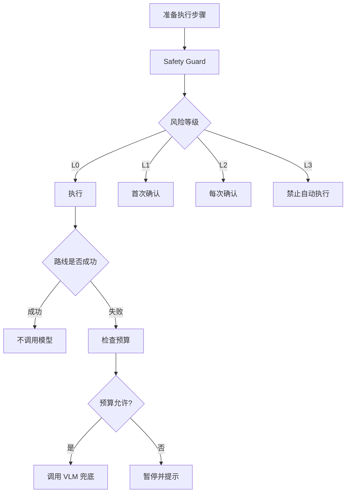

# 07. 安全风控、权限体检与成本控制

> 项目：SmartTask AI / AI 安卓自动化任务产品  
> 版本：v0.2  
> 日期：2026-05-23  
> 底层参考：AutoLXB 二次开发

## 1. 模块目标

Android 自动化产品必须先解决三件事：

```text
不乱操作
能稳定运行
不烧模型费用
```

对应三个模块：

- Safety Guard。
- Permission Doctor。
- Cost Monitor。

---

## 2. Safety Guard

### 2.1 风险等级

| 等级 | 类型 | 默认策略 |
|---|---|---|
| L0 低风险 | 打开 App、查看页面、签到、领取非现金积分 | 可自动执行 |
| L1 中风险 | 输入文本、提交普通表单、修改设置 | 首次确认，可记住 |
| L2 高风险 | 发消息、发动态、删除内容、提交订单 | 每次确认或白名单 |
| L3 禁止 | 支付、转账、贷款、账号注销、隐私授权 | 禁止自动执行 |

### 2.2 风险识别来源

| 来源 | 示例 |
|---|---|
| 动作类型 | send、delete、submit、pay |
| 页面关键词 | 支付、转账、确认订单、发送、删除 |
| App 分类 | 支付、银行、社交、购物 |
| AI 判断 | VLM 判断当前为付款确认页 |
| 用户标记 | 用户手动将步骤设为确认点 |

### 2.3 禁止动作

MVP 默认禁止：

- 支付。
- 转账。
- 借贷。
- 开通免密支付。
- 账号注销。
- 删除账号。
- 隐私授权最终确认。

处理方式：

```text
检测到 L3
 -> 停止自动化
 -> 提示原因
 -> 用户手动接管
```

### 2.4 强制确认动作

- 发送消息。
- 发布内容。
- 删除内容。
- 提交订单。
- 提交重要表单。
- 修改系统设置。

确认弹窗：

```text
即将执行高风险动作

App：微信
动作：发送消息
对象：张三
内容：我已经到了

[允许本次] [始终允许该任务] [取消]
```

---

## 3. Permission Doctor

### 3.1 检查项

| 检查项 | 必要性 | 说明 |
|---|---|---|
| Android 版本 | 必查 | 建议 Android 11+ |
| Core 状态 | 必查 | `lxb-core` 是否运行 |
| USB/Wireless Debugging | 必查 | 非 Root 路径需要 |
| Root 权限 | 可选 | Root 路径使用 |
| 无障碍服务 | 视实现 | UI 自动化能力可能需要 |
| 通知读取 | 通知触发必需 | Notification Listener |
| 电池无限制 | 强建议 | 防止后台被杀 |
| 输入法 | 建议 | 中文输入稳定性 |
| 悬浮窗/截图 | 视实现 | 截图/状态提示 |
| 模型配置 | 必查 | endpoint、key、model、vision |

### 3.2 权限体检页面

```text
权限体检

✅ Core：运行中
✅ 模型：可用，支持视觉
⚠️ 电池策略：未设为无限制
❌ 通知读取：未开启
✅ Android 版本：14

[修复通知权限]
[查看电池设置指引]
```

### 3.3 ROM 兼容提示

需要针对以下 ROM 提醒后台限制：

- MIUI / HyperOS。
- ColorOS。
- OriginOS。
- HarmonyOS / MagicOS。
- OneUI。

MVP 不需要完全自动修复，但要给用户明确步骤。

---

## 4. Cost Monitor

### 4.1 成本控制原则

```text
路线优先
规则优先
视觉兜底
用户可见
预算可控
```

### 4.2 控制策略

| 策略 | 说明 |
|---|---|
| 路线优先 | 路线能完成则不调用模型 |
| 通知规则粗筛 | 包名/标题/正文先匹配，再考虑 LLM 条件 |
| VLM 延迟调用 | 只有路线失败或页面未知时调用 |
| 相似页面缓存 | 同一页面短时间复用识别结果 |
| 每任务预算 | 限制单任务每日模型调用数 |
| 全局预算 | 限制全局每日/每月模型调用 |

### 4.3 用户可见数据

任务详情页展示：

```text
最近 7 天
执行 21 次
路线直接成功 18 次
AI 兜底 3 次
模型调用 3 次
平均耗时 12 秒
```

---

## 5. 安全与成本执行链路



---

## 6. MVP 验收

| 模块 | 验收 |
|---|---|
| Safety Guard | 发送/删除/提交必须确认 |
| L3 禁止 | 支付/转账不会自动点击最终确认 |
| Permission Doctor | 能展示 Core、通知、模型、电池状态 |
| Cost Monitor | 能统计模型调用次数 |
| UI | 高风险弹窗足够醒目且默认安全 |
